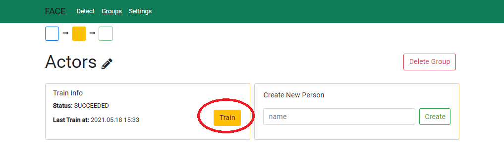

# Guide

## 1. Set api key

## 2. Create new group 

## 3. Create new person 

## 4. Upload pictures to new person 

## 5. Train your group 

## 6. Select group and upload image to face recognition. 

